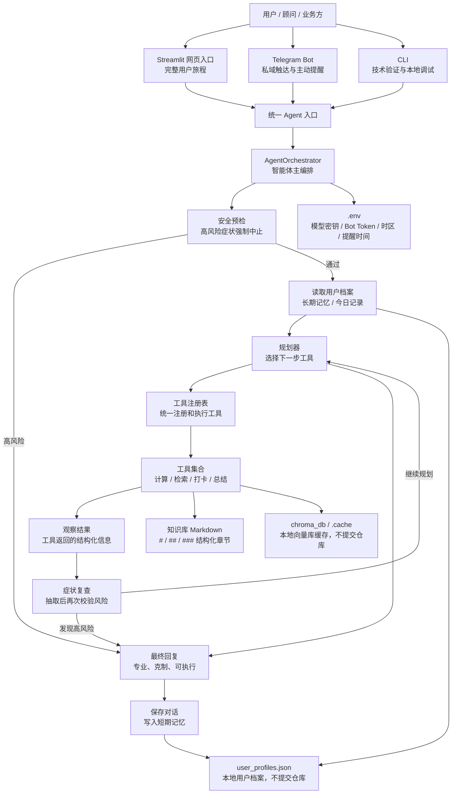

# PSMF Agent：AI 健康管理顾问行业解决方案

面向健康管理、减脂陪伴和营养咨询场景的 AI Agent 行业解决方案原型。它不是一个通用聊天机器人，而是围绕“用户建档、饮食 / 训练打卡、长期跟进、知识库问答、风险识别和多渠道触达”这一套具体业务流程设计的垂直行业 Agent。

项目以 PSMF（Protein Sparing Modified Fast）减脂协议为业务知识底座，结合 Gemini、RAG、本地用户记忆、Streamlit 网页入口、Telegram Bot、CLI 和安全规则，展示如何把专家经验转化为可运行、可解释、可扩展的 AI 健康管理顾问方案。

## 业务背景与客户痛点

目标客户可以包括：

- 健康管理机构
- 线上营养咨询服务商
- 私域减脂社群和健身教练团队
- 企业员工健康管理平台
- 智能客服 / AI 顾问产品团队

这些客户在交付健康管理服务时通常会遇到以下问题：

- 人工顾问需要重复回答大量高频问题，响应成本高、服务标准不稳定。
- 减脂陪伴依赖长期坚持，用户需要持续提醒、反馈和阶段性复盘。
- 个性化建议依赖历史体重、体脂、饮食、训练和身体反馈，普通 chatbot 难以连续跟进。
- 健康建议存在安全边界，需要识别胸痛、晕厥、呼吸困难、严重乏力等高风险症状。
- 企业希望把专家经验沉淀为知识库和标准化流程，降低对单个顾问经验的依赖。

## 解决方案概述

PSMF Agent 将健康管理场景拆解为一个“规划器 + 工具调用 + 记忆 + 知识库”的智能体工作流：

- 使用 **AgentOrchestrator** 管理有限轮工具调用：初始化状态、执行安全预检、读取用户档案、调用规划器、执行工具、吸收观察结果、生成最终回复并持久化对话。
- 使用 **规划器 / 推理器** 根据当前用户输入、用户档案、工具清单和上一轮观察结果选择下一步工具，输出简短的公开步骤摘要，不暴露完整推理链。
- 使用 **工具注册表** 统一管理 PSMF 计算、RAG 检索、记忆读写、饮食打卡、补剂打卡、每日总结和对话保存等工具。
- 使用 **RAG 知识库工具** 承载 PSMF 协议、食物数据库、训练指南、微量元素建议和症状风险矩阵，并通过 Markdown 标题语义切分提升检索命中质量。
- 使用 **用户长期记忆工具** 记录体重、体脂、Category、瘦体重估算、蛋白质目标、补剂打卡、饮食记录和对话历史。
- 使用 **Streamlit 网页入口** 展示完整用户旅程，适合方案沟通和业务验证。
- 使用 **Telegram Bot** 展示私域触达、主动提醒、长周期陪伴和移动端交互能力。
- 使用 **CLI** 支持快速技术验证和本地调试。
- 使用 **确定性安全护栏** 在普通建议生成前识别胸痛、胸闷、呼吸困难、晕厥、心律异常、意识模糊等高风险症状，触发强制中止并引导用户优先就医或寻求专业帮助。

从解决方案视角看，该项目展示的是一个“垂直行业 AI 顾问系统”的最小可行形态：既能说明客户问题，也能跑通业务流程，还能解释大模型、RAG、记忆和安全边界如何组合成可落地方案。

## 客户痛点 - Agent 能力 - 业务价值映射

| 客户痛点 | Agent 能力 | 业务价值 |
|---|---|---|
| 顾问重复回答高频问题，响应成本高 | RAG 垂直知识问答、PSMF 协议解释、食物库检索 | 降低人力成本，提高响应速度和服务一致性 |
| 用户难以长期坚持 | 每日打卡、补剂状态、复盘提醒、Telegram 触达 | 提升用户留存和服务连续性 |
| 普通 chatbot 缺少上下文 | 用户档案、历史打卡、对话记忆、阶段状态管理 | 支持个性化跟进，而不是一次性问答 |
| 健康场景存在风险 | 高风险症状识别、安全提醒、医疗边界声明 | 降低误导风险，增强方案可信度 |
| 专家经验难以规模化复制 | 知识库 + 流程化 Agent + 多入口交互 | 便于标准化交付和后续企业集成 |
| 客户难以理解 AI 价值 | Streamlit 可视化入口、Telegram 私域场景、CLI 技术验证 | 帮助业务方把技术能力理解为实际服务价值 |

## 架构说明



### 智能体运行流程

实际运行流程：

```text
用户输入
→ 确定性安全预检
→ AgentOrchestrator
→ 读取用户档案
→ 规划器选择工具
→ 执行工具
→ 记录观察结果
→ 必要时再次规划
→ 生成最终回复
→ 保存本轮可见对话
```

`AgentStep` 只记录公开步骤摘要，例如 `extract_user_facts` 或 `search_psmf_knowledge`，用于调试和问题定位；最终回复不会暴露完整推理链。

### 已注册工具

- `check_safety_risk`：确定性症状风险检查；命中强制中止信号时停止普通建议流程。
- `get_user_profile`：读取长期档案、每日记录、补剂状态、用户记忆和近期对话。
- `extract_user_facts`：从文本和可选图片中抽取结构化用户事实。
- `calculate_psmf_targets`：计算瘦体重、Category 和蛋白质目标范围。
- `update_user_profile`：保存体征、Category、蛋白质目标、提醒偏好和训练状态。
- `log_food`：将饮食打卡写入 `daily_logs`。
- `log_supplements`：记录补剂打卡状态。
- `update_supplement_products`：保存补剂标签或产品信息。
- `search_psmf_knowledge`：检索核心协议、训练指南、微量元素指南或症状矩阵。
- `search_food_database`：检索食物数据库内容。
- `generate_daily_summary`：生成当天宏量营养、补剂和进展摘要。
- `generate_weekly_report`：生成最近七天滚动报告。
- `save_conversation_turn`：保存本轮用户与助手的可见对话。

## RAG 技术实现

本项目的 RAG 不是简单的按句子或固定字符窗口切分，而是面向知识库文档结构做了标题语义切分。

| 技术点 | 当前实现 | 业务价值 |
|---|---|---|
| 知识库结构 | Markdown 文档使用 `# / ## / ###` 组织协议、食物库、训练指南、微量元素和症状矩阵 | 专家知识可维护、可审阅，便于顾问团队持续沉淀 |
| 切分策略 | `rag_system.py` 使用 `markdown_heading_v2`，按 Markdown 标题层级拆分章节 | 避免把不同主题混在同一块，提升垂直问答准确性 |
| 文本块上下文 | 每个文本块都会在正文前保留当前标题路径，并写入 `section_path`、`section_title`、`heading_level` 元数据 | 检索结果更可解释，方便定位命中章节 |
| 表格处理 | 食材表、症状矩阵等 Markdown 表格保持行结构；超长表格按行切分并保留表头 | 避免营养数据、风险矩阵被切坏 |
| 超长内容兜底 | 单个段落或表格过长时才回退到字符滑窗，默认 `chunk_size=900`、`chunk_overlap=120` | 兼顾语义完整性和向量检索粒度 |
| 向量存储 | 使用 ChromaDB 本地持久化索引，主知识库集合为 `psmf_knowledge`，食物库集合为 `food_db` | 支持本地概念验证，不依赖外部向量数据库 |
| 索引版本 | `RAG_CHUNKING_VERSION` 写入元数据；切分策略升级后会触发本地索引重建 | 保证运行时使用最新知识切分方式 |
| 检索控制 | 支持按 `source` 过滤指定知识文件，并对食物库检索做轻量重排序 | 让 Agent 在不同业务问题中调用更合适的知识源 |

## 功能模块说明

| 文件 | 模块作用 | 项目展示价值 |
|---|---|---|
| `agent/orchestrator.py` | Agent 主编排，执行安全预检、规划器 / 工具循环、观察结果吸收和记忆持久化 | 展示标准工具调用型 Agent，而不是线性 if/else 流程 |
| `agent/planner.py` | 规划器和 Gemini 适配层，输出结构化 JSON 动作与公开步骤摘要；支持无模型环境下的兜底运行 | 展示工具选择、有限轮重新规划和可测试运行 |
| `agent/tool_registry.py` | 统一 ToolSpec / ToolCall / ToolResult 注册与执行 | 展示真实工具抽象，方便扩展企业工具或第三方系统 |
| `agent/schemas.py` | AgentState、AgentStep、AgentContext 等结构 | 展示状态、观察记录和工具调用记录如何组织 |
| `agent/safety.py` | 高风险症状确定性强制中止护栏 | 说明医疗安全边界是前置护栏，不是普通业务路由 |
| `agent/psmf_tools.py` | LBM、Category、蛋白质目标等 PSMF 计算工具 | 将专业计算从主流程抽离为可测试工具 |
| `agent/memory_tools.py` | 用户档案、饮食、补剂、总结、对话保存等记忆工具 | 展示长期服务能力通过工具被 agent 调用 |
| `agent/rag_tools.py` | PSMF 知识库和食物库检索工具 | 展示 RAG 是可选工具调用而非硬编码路由 |
| `app.py` | Streamlit 网页入口，支持登录、聊天、侧栏用户档案、图片上传和复盘展示 | 用于方案沟通中呈现完整用户旅程，让非技术角色直观看到方案效果 |
| `telegram_bot.py` | Telegram Bot 入口，支持文本、图片、命令、调度器和主动提醒 | 展示私域触达、移动端服务和持续陪伴能力 |
| `main.py` | CLI 入口，初始化 RAG 并启动终端对话 | 用于快速技术验证和本地调试，证明核心 Agent 不依赖单一 UI |
| `psmf_engine.py` | 兼容层，保留旧 `GeminiPSMFAgent` 名称并委托给 `AgentOrchestrator` | 降低迁移成本，同时让新架构成为真实运行路径 |
| `rag_system.py` | 基于 ChromaDB 的本地知识库索引和检索，支持 Markdown 标题语义切分、表格保留、来源过滤和文本块元数据 | 展示专家知识沉淀、可控问答、检索可解释性和行业知识增强能力 |
| `memory_manager.py` | 管理用户档案、每日记录、补剂状态、历史对话和长期记忆 | 展示长期用户服务能力和个性化跟进能力 |
| `system_prompt.txt` | Agent 角色、语气和行为边界 | 展示 Prompt 设计与行业角色定义能力 |
| `psmf_core_protocol.md` | PSMF 核心协议知识 | 支撑专业规则问答和方案解释 |
| `psmf_food_database.md` | 食物和营养相关知识库 | 支撑饮食建议、食材选择和打卡反馈 |
| `psmf_training_guide.md` | 训练建议知识库 | 支撑减脂期训练安排说明 |
| `symptom_diagnostic_matrix.md` | 症状风险矩阵 | 支撑健康风险识别和安全提醒 |
| `.env.example` | 环境变量模板 | 展示部署配置、密钥隔离和原型可移植性 |

## 演示路径

这是一条适合快速理解项目能力的用户旅程主线：


1. **输入用户基础信息**
   示例：用户说明性别、体重、体脂、目标、当前饮食状态和训练习惯。

2. **Agent 通过工具建档并给出初始建议**
   展示系统如何通过 `extract_user_facts`、`calculate_psmf_targets`、`update_user_profile` 估算 LBM、判断 Category、给出蛋白质目标和起步建议。

3. **输入饮食或训练打卡**
   示例：用户记录一餐食物、一次训练反馈或补剂状态。

4. **Agent 基于记忆工具给出反馈**
   展示系统如何通过 `get_user_profile`、`generate_daily_summary` 读取用户档案和历史记录，给出上下文相关建议。

5. **触发每日总结 / 阶段复盘**
   输入“今日复盘”或 `/summary`，展示长期记忆、结构化总结和服务连续性。

6. **输入高风险症状，展示安全强制中止**
   示例：用户描述胸痛、晕厥、呼吸困难或意识模糊。系统会优先触发安全护栏，不继续 RAG、饮食建议或训练建议。

7. **总结行业扩展价值**
   将用户旅程映射到企业健康管理、私域社群运营、线上营养咨询或智能客服场景，说明如何接入 CRM、会员系统、企业知识库和人工顾问工作台。

## 快速开始

建议使用 Python 3.10+。首次运行 RAG 时，ChromaDB 默认嵌入模型可能需要下载缓存，需保证网络和磁盘权限。

```bash
python3 -m venv .venv
source .venv/bin/activate
pip install -r requirements.txt
cp .env.example .env
```

编辑 `.env`，填写必要配置：

```bash
GEMINI_API_KEY=你的 Gemini API Key
TELEGRAM_BOT_TOKEN=你的 Telegram Bot Token
```

启动 Streamlit 网页入口：

```bash
streamlit run app.py
```

启动 Telegram Bot：

```bash
python telegram_bot.py
```

启动 CLI：

```bash
python main.py
```

运行轻量冒烟测试：

```bash
python scripts/smoke_test.py
```

## 安全与合规边界

- 本项目是 AI 应用原型，用于方案验证和演示，不替代医生、营养师或医疗机构的专业判断。
- 对胸痛、晕厥、呼吸困难、严重乏力、意识模糊、心律异常等高风险症状，应提示用户优先就医或联系专业人员。
- 健康管理建议应被视为辅助信息，不应作为诊断、治疗或紧急处置依据。
- 不应提交真实 API Key、Telegram Token、用户健康数据、聊天记录、日志、向量库缓存或虚拟环境。
- `.env`、`user_profiles.json`、`chroma_db/`、`.cache/`、`venv/`、`.venv/`、`__pycache__/` 等均应保持在 `.gitignore` 中。

## 项目能力映射

这个项目体现以下面向 AI 解决方案岗位的能力：

- **客户业务痛点分析**：从健康管理服务中识别成本、留存、标准化、风险边界等关键问题。
- **行业场景拆解**：将减脂陪伴拆解为建档、打卡、问答、复盘、提醒和风险识别等流程。
- **AI 解决方案架构设计**：把大模型、RAG、用户记忆、多入口交互和安全规则组合为完整架构。
- **概念验证快速构建**：用 Streamlit、Telegram 和 CLI 快速形成可运行、可验证的最小方案。
- **用户旅程设计**：围绕客户痛点组织项目展示路径，而不是只展示单点功能。
- **技术价值转商业价值**：将 RAG、记忆和 Agent 编排映射为降本增效、服务连续性、用户留存和规模化交付。
- **风险边界和落地意识**：在健康场景中体现敏感数据隔离、安全提醒、免责声明和人工介入思路。

## 更多材料

- [解决方案概览](docs/solution-overview.md)
- [演示流程](docs/demo-walkthrough.md)
- [项目亮点与能力映射](docs/project-highlights.md)
