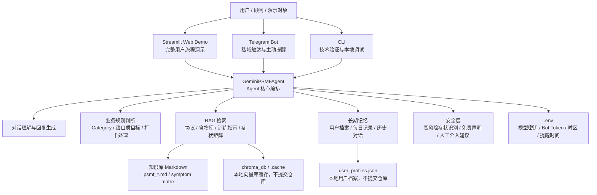
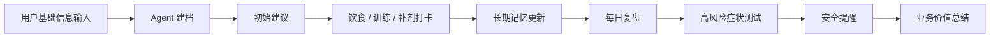

# PSMF Agent：AI 健康管理顾问行业解决方案 PoC

面向健康管理、减脂陪伴和营养咨询场景的 AI Agent 行业解决方案 PoC。它不是一个通用聊天机器人，而是围绕“用户建档、饮食/训练打卡、长期跟进、知识库问答、风险识别和多渠道触达”这一套具体业务流程设计的垂直行业 Agent。

项目以 PSMF（Protein Sparing Modified Fast）减脂协议为业务知识底座，结合 Gemini、RAG、本地用户记忆、Streamlit Web Demo、Telegram Bot、CLI 和安全规则，展示如何把专家经验转化为可演示、可解释、可扩展的 AI 健康管理顾问 PoC。

## 业务背景与客户痛点

目标客户可以包括：

- 健康管理机构
- 线上营养咨询服务商
- 私域减脂社群和健身教练团队
- 企业员工健康管理平台
- 智能客服 / AI 顾问产品团队

这些客户在交付健康管理服务时通常会遇到以下问题：

- 人工顾问需要重复回答大量高频问题，响应成本高、服务标准不稳定。
- 减脂陪伴依赖长期坚持，用户需要持续提醒、反馈和阶段性复盘。
- 个性化建议依赖历史体重、体脂、饮食、训练和身体反馈，普通 chatbot 难以连续跟进。
- 健康建议存在安全边界，需要识别胸痛、晕厥、呼吸困难、严重乏力等高风险症状。
- 企业希望把专家经验沉淀为知识库和标准化流程，降低对单个顾问经验的依赖。

## 解决方案概述

PSMF Agent 将健康管理场景拆解为一个可演示的 AI Agent 闭环：

- 使用 **Gemini / LLM** 负责自然语言理解、回答生成和图片信息提取。
- 使用 **RAG 知识库** 承载 PSMF 协议、食物数据库、训练指南、微量元素建议和症状风险矩阵。
- 使用 **用户长期记忆** 记录体重、体脂、Category、瘦体重估算、蛋白质目标、补剂打卡、饮食记录和对话历史。
- 使用 **饮食 / 训练 / 补剂打卡** 支撑用户日常跟进、阶段复盘和服务连续性。
- 使用 **Streamlit Web Demo** 展示完整用户旅程，适合方案沟通、客户验证和 PoC 演示。
- 使用 **Telegram Bot** 展示私域触达、主动提醒、长周期陪伴和移动端交互能力。
- 使用 **CLI** 支持快速技术验证和本地调试。
- 使用 **安全风险识别规则** 对高风险症状触发提醒，引导用户优先就医或寻求专业帮助。

从售前视角看，该项目展示的是一个“垂直行业 AI 顾问解决方案”的最小可行形态：既能讲清客户问题，也能演示业务流程，还能说明大模型、RAG、记忆和安全边界如何组合成可落地方案。

## 客户痛点 - Agent 能力 - 业务价值映射

| 客户痛点 | Agent 能力 | 业务价值 |
|---|---|---|
| 顾问重复回答高频问题，响应成本高 | RAG 垂直知识问答、PSMF 协议解释、食物库检索 | 降低人力成本，提高响应速度和服务一致性 |
| 用户难以长期坚持 | 每日打卡、补剂状态、复盘提醒、Telegram 触达 | 提升用户留存和服务连续性 |
| 普通 chatbot 缺少上下文 | 用户档案、历史打卡、对话记忆、阶段状态管理 | 支持个性化跟进，而不是一次性问答 |
| 健康场景存在风险 | 高风险症状识别、安全提醒、医疗边界声明 | 降低误导风险，增强方案可信度 |
| 专家经验难以规模化复制 | 知识库 + 流程化 Agent + 多入口 Demo | 便于标准化交付和后续企业集成 |
| 客户难以理解 AI 价值 | Streamlit 可视化 Demo、Telegram 私域场景、CLI 技术验证 | 帮助售前把技术能力转化为业务价值 |

## 架构说明



## 功能模块说明

| 文件 | 模块作用 | 在售前演示中的价值 |
|---|---|---|
| `app.py` | Streamlit 网页入口，支持登录、聊天、侧栏用户档案、图片上传和复盘展示 | 用于方案沟通中演示完整用户旅程，让非技术角色直观看到方案效果 |
| `telegram_bot.py` | Telegram Bot 入口，支持文本、图片、命令、调度器和主动提醒 | 展示私域触达、移动端服务和持续陪伴能力 |
| `main.py` | CLI 入口，初始化 RAG 并启动终端对话 | 用于快速技术验证和本地调试，证明核心 Agent 不依赖单一 UI |
| `psmf_engine.py` | Agent 核心编排，包含 Gemini 调用、体征提取、业务规则、RAG 门控和风险提示 | 展示如何把 LLM 能力与垂直业务规则结合，而不是只做通用聊天 |
| `rag_system.py` | 基于 ChromaDB 的本地知识库索引和检索 | 展示专家知识沉淀、可控问答和行业知识增强能力 |
| `memory_manager.py` | 管理用户档案、每日记录、补剂状态、历史对话和长期记忆 | 展示长期用户服务能力和个性化跟进能力 |
| `system_prompt.txt` | Agent 角色、语气和行为边界 | 展示 Prompt 设计与行业角色定义能力 |
| `psmf_core_protocol.md` | PSMF 核心协议知识 | 支撑专业规则问答和方案解释 |
| `psmf_food_database.md` | 食物和营养相关知识库 | 支撑饮食建议、食材选择和打卡反馈 |
| `psmf_training_guide.md` | 训练建议知识库 | 支撑减脂期训练安排说明 |
| `symptom_diagnostic_matrix.md` | 症状风险矩阵 | 支撑健康风险识别和安全提醒 |
| `.env.example` | 环境变量模板 | 展示部署配置、密钥隔离和 PoC 可移植性 |

## Demo 演示路径

这是一条适合 5-8 分钟方案沟通或客户验证的演示主线：



1. **输入用户基础信息**  
   示例：用户说明性别、体重、体脂、目标、当前饮食状态和训练习惯。

2. **Agent 判断当前阶段并给出初始建议**  
   展示系统如何估算 LBM、判断 Category、给出蛋白质目标和起步建议。

3. **输入饮食或训练打卡**  
   示例：用户记录一餐食物、一次训练反馈或补剂状态。

4. **Agent 基于历史记录给出反馈**  
   展示系统如何读取用户档案和历史记录，给出上下文相关建议。

5. **触发每日总结 / 阶段复盘**  
   输入“今日复盘”或 `/summary`，展示长期记忆、结构化总结和服务连续性。

6. **输入高风险症状，展示安全提醒**  
   示例：用户描述胸痛、晕厥、呼吸困难或严重乏力，展示安全边界和就医建议。

7. **总结行业扩展价值**  
   将 Demo 映射到企业健康管理、私域社群运营、线上营养咨询或智能客服场景，说明如何接入 CRM、会员系统、企业知识库和人工顾问工作台。

## 快速开始

建议使用 Python 3.10+。首次运行 RAG 时，ChromaDB 默认嵌入模型可能需要下载缓存，需保证网络和磁盘权限。

```bash
python3 -m venv .venv
source .venv/bin/activate
pip install -r requirements.txt
cp .env.example .env
```

编辑 `.env`，填写必要配置：

```bash
GEMINI_API_KEY=你的 Gemini API Key
TELEGRAM_BOT_TOKEN=你的 Telegram Bot Token
```

启动 Streamlit Web Demo：

```bash
streamlit run app.py
```

启动 Telegram Bot：

```bash
python telegram_bot.py
```

启动 CLI：

```bash
python main.py
```

## 安全与合规边界

- 本项目是 AI 应用原型 / PoC，用于方案验证和演示，不替代医生、营养师或医疗机构的专业判断。
- 对胸痛、晕厥、呼吸困难、严重乏力、意识模糊、心律异常等高风险症状，应提示用户优先就医或联系专业人员。
- 健康管理建议应被视为辅助信息，不应作为诊断、治疗或紧急处置依据。
- 不应提交真实 API Key、Telegram Token、用户健康数据、聊天记录、日志、向量库缓存或虚拟环境。
- `.env`、`user_profiles.json`、`chroma_db/`、`.cache/`、`venv/`、`.venv/`、`__pycache__/` 等均应保持在 `.gitignore` 中。

## Presales Capability Mapping

这个项目体现以下 AI 售前 / 解决方案顾问 / Presales Engineer 相关能力：

- **客户业务痛点分析**：从健康管理服务中识别成本、留存、标准化、风险边界等关键问题。
- **行业场景拆解**：将减脂陪伴拆解为建档、打卡、问答、复盘、提醒和风险识别等流程。
- **AI 解决方案架构设计**：把 LLM、RAG、用户记忆、多入口交互和安全规则组合为完整架构。
- **PoC 快速构建**：用 Streamlit、Telegram 和 CLI 快速形成可演示、可验证的最小方案。
- **Demo Storyline 设计**：围绕客户痛点组织演示路径，而不是只展示单点功能。
- **技术价值转商业价值**：将 RAG、记忆和 Agent 编排映射为降本增效、服务连续性、用户留存和规模化交付。
- **风险边界和落地意识**：在健康场景中体现敏感数据隔离、安全提醒、免责声明和人工介入思路。

## 更多材料

- [解决方案概览](docs/solution-overview.md)
- [Demo 演示流程](docs/demo-walkthrough.md)
- [项目亮点与能力映射](docs/project-highlights.md)
