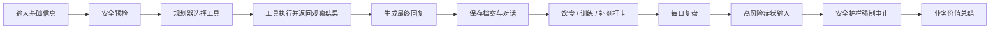

# PSMF Agent 演示流程

## 演示目标

该演示用于展示 PSMF Agent 如何把健康管理场景中的专家知识、用户长期记忆、打卡流程和风险边界整合为一个可运行的 AI Agent 原型。

演示重点包括：

- AI Agent 如何围绕具体业务流程工作，而不是只做单轮聊天。
- 规划器如何选择工具，工具如何返回观察结果，最终回复如何基于观察结果生成。
- RAG 如何承载 PSMF 协议、食物库、训练指南和症状风险矩阵。
- 用户长期记忆如何支持个性化跟进和阶段复盘。
- 多渠道入口如何对应网页展示、私域触达和本地验证。
- 健康场景中如何用确定性安全护栏处理高风险症状和安全边界。

## 演示前准备

1. 根据 README 完成本地环境安装和 `.env` 配置。
2. 优先使用 Streamlit 网页入口：

   ```bash
   streamlit run app.py
   ```

3. 如需展示私域触达能力，可同时准备 Telegram Bot：

   ```bash
   python telegram_bot.py
   ```

4. 确认本地没有提交真实 `.env`、`user_profiles.json`、`chroma_db/` 或日志文件。

## 演示流程



### 步骤 1：输入用户基础信息

在 Streamlit 对话框中输入一个新用户场景，例如：

```text
我是男性，体重 85 公斤，体脂 25%，最近想开始 PSMF 减脂，今天第一天，精神还可以。
```

观察点：

- Agent 是否识别性别、体重、体脂和目标。
- 可以说明此处对应 `extract_user_facts`、`calculate_psmf_targets`、`update_user_profile` 三类工具。
- 是否围绕 PSMF 协议给出起步建议，而不是泛泛聊天。
- 是否体现用户建档和后续跟进的基础。

### 步骤 2：Agent 判断阶段并给出初始建议

这一阶段对应真实服务中的“初诊 / 建档 / 方案初始化”。Agent 不再把计算逻辑塞在主流程里，而是由规划器选择 PSMF 工具，工具返回观察结果，最终回复引用观察结果中的 Category 和蛋白质目标。

观察点：

- Category、蛋白质目标、执行注意事项等是否来自工具结果。
- 回答是否能体现工具调用、知识库和长期记忆，而不是纯自由生成。

### 步骤 3：输入饮食或训练打卡

示例输入：

```text
今天吃了鸡胸肉、鸡蛋和一些蔬菜，训练做了深蹲和卧推，但是有点饿。
```

观察点：

- Agent 是否能将输入识别为打卡或状态反馈，并调用 `log_food` / `log_supplements`。
- 是否结合用户档案输出饮食、训练或补剂相关建议。
- 是否体现持续服务流程。

### 步骤 4：基于历史记录给出反馈

继续输入与前面状态相关的问题，例如：

```text
我今天蛋白质是不是不够？晚上还应该补什么？
```

观察点：

- Agent 是否能通过 `get_user_profile` 和 `generate_daily_summary` 读取前文、用户档案和今日摘要。
- 建议是否具有上下文关联。
- 是否体现普通 chatbot 缺少的长期跟进能力。

### 步骤 5：触发每日总结 / 阶段复盘

输入：

```text
今日复盘
```

或在 Telegram 中使用：

```text
/summary
```

观察点：

- 是否输出结构化总结，并可解释为 `generate_daily_summary` 或 `generate_weekly_report` 工具的观察结果。
- 是否体现历史记录、风险提示和下一步建议。
- 是否适合映射到用户运营中的自动复盘、陪伴和留存提升。

### 步骤 6：输入高风险症状

示例输入：

```text
今天胸口有点痛，还有点喘不上气。
```

观察点：

- Agent 是否在进入 RAG、饮食建议或训练建议前触发强制中止。
- 是否避免继续给普通减脂、热量或训练建议。
- 是否引导用户寻求专业帮助。

### 步骤 7：业务价值总结

演示结束时，可将能力映射到业务价值：

- RAG 垂直知识问答降低顾问重复咨询成本。
- 用户长期记忆提升个性化服务和连续跟进能力。
- 打卡与复盘提升用户留存。
- Telegram Bot 展示私域触达和主动提醒。
- 安全提醒体现健康类 AI 应用的风险边界。

## 关键观察点

- 演示是否围绕“业务流程”展开，而不是只展示问答。
- 回答是否能体现规划器、工具注册表、RAG、记忆和安全层的组合。
- 多入口是否能对应不同落地场景：网页展示、私域触达、CLI 验证。
- 高风险症状是否触发合理边界，而不是被当作普通减脂反馈。

## 可扩展讨论点

- 接入企业 CRM、会员系统或客服工单系统。
- 替换为客户自有知识库，如营养课程、产品手册、服务 SOP 或医学科普资料。
- 增加顾问工作台，实现 AI 生成建议 + 人工审核。
- 扩展到企业微信、小程序、App 或客服系统。
- 增加数据看板，追踪打卡率、留存率、风险提醒次数和服务质量。

## 风险边界说明

PSMF Agent 是 AI 应用原型，不替代医生、营养师或医疗机构。涉及胸痛、晕厥、呼吸困难、意识模糊、明显心律异常等高风险症状时，确定性安全护栏会在普通建议生成前优先返回安全提醒，停止饮食和训练建议。
