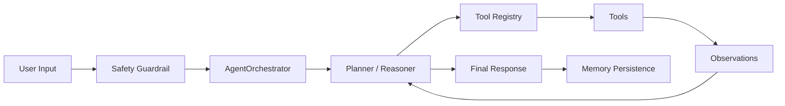

# PSMF Agent 解决方案概览

## 项目定位

PSMF Agent 是一个面向健康管理、减脂陪伴和营养咨询场景的 Tool-Using Health Management Agent PoC。项目围绕 PSMF 减脂协议，将 LLM Planner、Tool Registry、RAG 知识库、用户长期记忆、打卡复盘、多渠道入口和 deterministic safety guardrail 整合成一个可演示、可解释、可扩展的 AI 健康管理顾问原型。

它的重点不是展示单次聊天能力，而是验证 AI Agent 如何承接真实服务流程：用户建档、个性化建议、饮食 / 训练 / 补剂打卡、阶段复盘、私域触达和风险边界提示。

## 目标客户

- 健康管理机构
- 线上营养咨询服务商
- 私域减脂社群和健身教练团队
- 企业员工健康管理平台
- 智能客服 / AI 顾问产品团队

## 典型业务痛点

- 人工顾问重复回答高频问题，响应成本高，服务标准不稳定。
- 用户减脂周期长，容易中断，需要持续提醒、反馈和复盘。
- 个性化建议依赖历史体重、体脂、饮食、训练和身体反馈，普通 chatbot 难以持续跟进。
- 健康建议存在风险边界，需要识别高风险症状并引导人工或专业机构介入。
- 企业希望将专家经验沉淀为知识库和标准化流程，支撑规模化服务。

## 解决方案概述

PSMF Agent 使用 `AgentOrchestrator` 管理一个 bounded ReAct-style tool loop。每轮对话会先执行 deterministic safety pre-check；未触发 hard stop 时，系统读取用户档案，让 Planner 根据用户输入、工具 manifest 和 observation 选择下一步工具。工具执行后返回 `ToolResult`，并被记录为 `AgentStep`，Planner 可以继续 re-plan，直到进入 final response 和 memory persistence。

Gemini 负责 planner decision、结构化抽取、图片信息理解和最终回复生成；ChromaDB 本地 RAG 知识库和 `memory_manager.py` 则作为工具底层服务。RAG 入库采用 Markdown 标题语义切分，保留章节路径和来源元数据，方便解释检索结果来自哪一类专家知识。

系统支持三类入口：Streamlit Web Demo 用于完整用户旅程展示，Telegram Bot 用于私域触达和持续陪伴，CLI 用于技术验证和本地调试。Agent 会基于用户档案、历史打卡和当前输入生成上下文相关反馈，并对胸痛、晕厥、呼吸困难、严重乏力等高风险描述触发安全提醒。

`psmf_engine.py` 现在仅作为 legacy compatibility wrapper 保留旧 `GeminiPSMFAgent` 名称；真实运行路径在 `agent/orchestrator.py`、`agent/planner.py` 和 `agent/*_tools.py`。

## 核心能力

- **垂直知识问答**：基于 PSMF 协议、食物库、训练指南和症状矩阵进行回答。
- **用户长期记忆**：记录用户档案、历史对话、饮食 / 训练打卡和补剂状态。
- **工具调用架构**：PSMF 计算、RAG、记忆、饮食打卡、补剂打卡、总结和对话保存都通过 Tool Registry 调用。
- **可调试 observation trace**：每个 `AgentStep` 记录公开摘要、`ToolCall` 和 `ToolResult`，便于演示与排错，但不暴露完整 chain-of-thought。
- **连续服务流程**：支持每日打卡、阶段复盘和主动提醒。
- **多渠道触达**：Web Demo 用于方案演示，Telegram 用于私域陪伴，CLI 用于技术验证。
- **安全风险识别**：对胸痛、晕厥、呼吸困难、意识模糊、心律异常等高风险症状执行 hard stop，停止饮食/训练建议并提示就医。

## Demo 演示流程

1. 输入用户基础信息：性别、体重、体脂、目标和当前状态。
2. Agent 通过工具抽取体征、计算 PSMF targets 并更新档案。
3. 用户输入饮食、训练或补剂打卡。
4. Agent 结合历史档案给出上下文相关反馈。
5. 触发每日总结或阶段复盘，展示长期记忆能力。
6. 输入高风险症状，展示 deterministic safety guardrail 和人工介入边界。
7. 总结方案如何扩展到企业健康管理、私域运营或智能客服场景。

## 业务价值

- 降低人工顾问重复咨询成本。
- 提升用户响应速度和服务连续性。
- 将专家经验沉淀为可复用知识库。
- 支持个性化服务和用户数据沉淀。
- 提高健康类 AI 应用的安全边界意识。
- 帮助客户用低成本 PoC 验证 AI Agent 落地价值。

## 实施扩展方向

- 接入企业会员系统、CRM 或客服工单系统。
- 将知识库替换为客户自有营养、运动、医疗或产品资料。
- 增加顾问工作台，实现 AI 建议 + 人工审核的协同流程。
- 接入企业微信、微信公众号、小程序或 App。
- 增加数据看板，用于用户留存、打卡率、风险提醒和服务质量分析。

## 风险与边界

- 本项目是 AI 应用原型 / PoC，不替代医生、营养师或医疗机构。
- 高风险症状应提示用户就医或联系专业人员。
- 不应在仓库中提交真实 API Key、用户健康数据、日志或向量库缓存。
- 正式商用前需要结合目标市场的医疗、隐私和数据合规要求进行评估。
